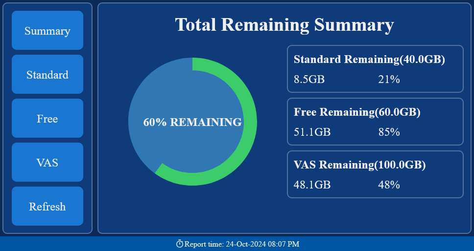
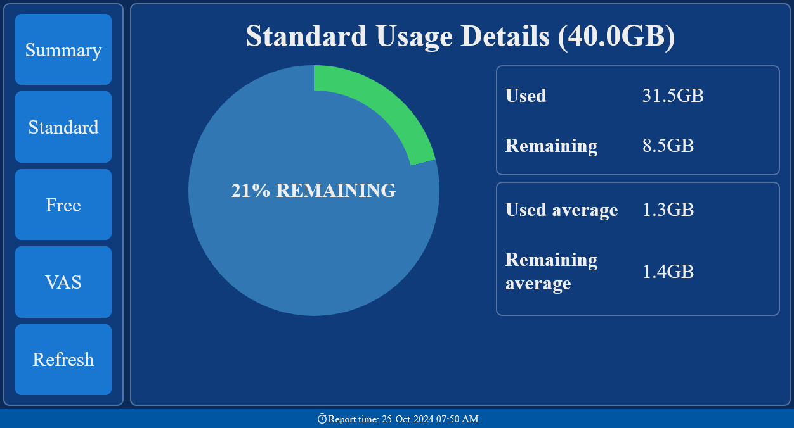
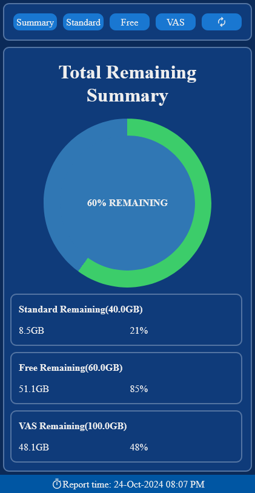
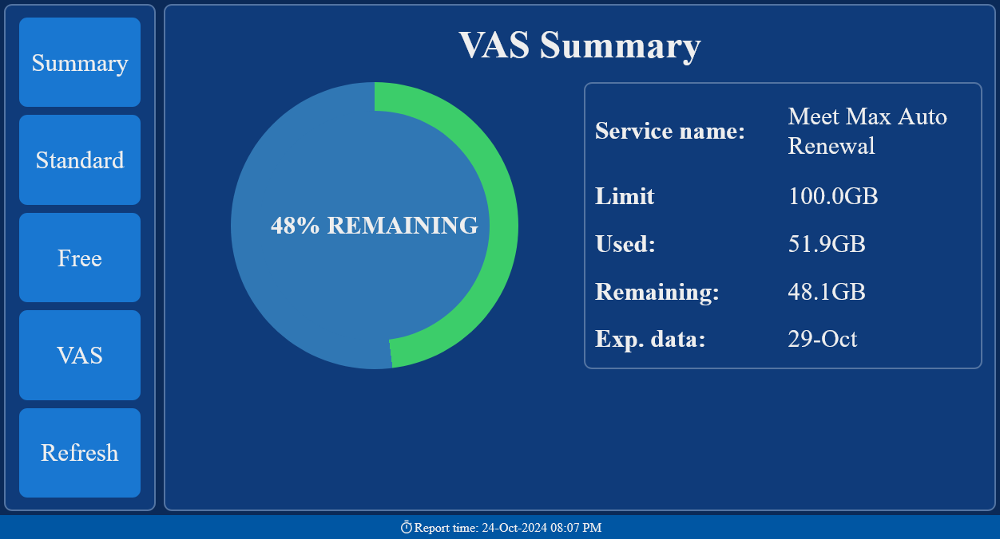

# SLT Usage Analyzer

A desktop webapplication for checking SLT usage build in python.


## Features
 - Automatic login and extraction of usage data.
 - Descriptive graphical representation of retrieved data.
 - Consise logging through [ loguru ](https://github.com/Delgan/loguru) package.
 - Config file hash validation.

## Getting Started
### Dependencies
 - `python` 
 - [PowerShell](https://github.com/PowerShell/PowerShell)
 - [pipx](https://github.com/pypa/pipx) *optional*

 *SLT Usage Analyzer uses chrome browser as the default option for viewing the GUI. Other browsers can be specified in the config file.*

#### Installing via `pip`

```bash
pip install git+https://github.com/gamithaKalharaW/SLT-Usage-Analyzer
```
The application can be run either as a python module or as an executable script.

```bash
python -m sltusageanalyzer
```
*or*
```bash
sltusageanalyzer
```

#### Installing via `pipx`

```bash
pipx install git+https://github.com/gamithaKalharaW/SLT-Usage-Analyzer
```

The application can be run as an executable script.

```bash
sltusageanalyzer
```

#### Installing from wheel file
 - Download the wheel file from [here](https://github.com/gamithaKalharaW/SLT-Usage-Analyzer/releases/latest).
 - Run either `pip install` or `pipx install` to install the wheel file.

#### Packaging from source
You can also manualy build the wheel file & install it using `poetry`.

```bash
git clone https://github.com/gamithaKalharaW/SLT-Usage-Analyzer
cd SLT-Usage-Analyzer
poetry build
cd dist
# pip or pipx
pip install sltusageanalyzer*.whl
```

## Configuration

### Command-line Options

```bash
Usage: sltusageanalyzer [OPTIONS]

Options:
  --debug               Run with DEBUG log-level
  -p, --port INTEGER    Port to run on. Default: 3000
  -ch, --checkhealth    Check application health
  -uc, --update-config  Update config file
  -r, --reload          Fetch new data before app startup
  -s, --server TEXT     Run app as web server
  --version             Show the version and exit.
  --help                Show this message and exit.
```

### Config file options
The configuration file is stored at `%HOMEPATH%\.sltusageanalyzer\.analyzer.config`.

 - `BROWSER_PATH`: Path to browser. Defaults to `C:\Program Files\Google\Chrome\Application\chrome.exe`
 - Auth data(`USERNAME`, `PASSWORD`, `ID`): SLT credentials.

#### Updating the config file
 - Updating the config options using the command line option. *recomended*
 ```bash
sltusageanalyzer --update-config
 ```
 - Manually editing the config file.

 *When manually editing the `.analyzer.config` file, it is necessary to also update the `.analyzer.condig.hash` file as well.*

```python
import hashlib

with open('.analyzer.config', 'rb') as f:
    config = f.read()
    config_hash = hashlib.sha256(config).hexdigest()
with open('.analyzer.config.hash', 'w') as f:
    f.write(config_hash)
```

## Screenshots




